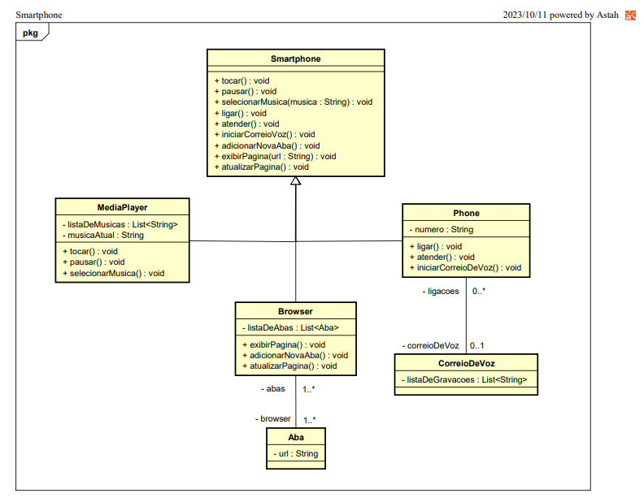

# Orientação a Objetos e UML: Diagramação de Classes do iPhone

# Descrição

Este é um modelo representativo do Smartphone herdando funcionalidades conforme o diagrama de classes abaixo:



# Programa

```java
import java.util.ArrayList;
import java.util.List;

// Classe MediaPlayer
class MediaPlayer {
    private List<String> listaDeMusicas;
    private String musicaAtual;

    public MediaPlayer() {
        listaDeMusicas = new ArrayList<>();
        musicaAtual = "";
    }

    public void tocar() {
        System.out.println("Tocando música");
    }

    public void pausar() {
        System.out.println("Pausando música");
    }

    public void selecionarMusica(String musica) {
        musicaAtual = musica;
        System.out.println("Selecionando música: " + musica);
    }
}

// Classe Phone
class Phone {
    private String numero;
    private CorreioDeVoz correioVoz;

    public Phone() {
        numero = "";
        correioVoz = new CorreioDeVoz();
    }

    public void ligar() {
        System.out.println("Realizando chamada");
    }

    public void atender() {
        System.out.println("Atendendo chamada");
    }

    public void iniciarCorreioVoz() {
        System.out.println("Iniciando correio de voz");
        correioVoz.iniciarGravacao();
    }
}

// Classe Browser
class Browser {
    private List<Aba> listaDeAbas;

    public Browser() {
        listaDeAbas = new ArrayList<>();
    }

    public void adicionarNovaAba(Aba aba) {
        listaDeAbas.add(aba);
        System.out.println("Nova aba adicionada com URL: " + aba.getUrl());
    }

    public void exibirPagina(String url) {
        System.out.println("Exibindo página: " + url);
    }

    public void atualizarPagina() {
        System.out.println("Atualizando página");
    }
}

// Classe CorreioDeVoz
class CorreioDeVoz {
    private List<String> listaDeGravacoes;

    public CorreioDeVoz() {
        listaDeGravacoes = new ArrayList<>();
    }

    public void iniciarGravacao() {
        System.out.println("Iniciando gravação de mensagem de voz");
    }
}

// Classe Aba
class Aba {
    private String url;

    public Aba(String url) {
        this.url = url;
    }

    public String getUrl() {
        return url;
    }
}

// Classe Smartphone que herda métodos das outras classes
class Smartphone extends MediaPlayer, Phone, Browser {
}

// Classe principal com o método main
public class Main {
    public static void main(String[] args) {
        Smartphone smartphone = new Smartphone();

        smartphone.tocar();
        smartphone.pausar();
        smartphone.selecionarMusica("Música 1");

        smartphone.ligar();
        smartphone.atender();
        smartphone.iniciarCorreioVoz();

        Aba aba1 = new Aba("www.example.com");
        smartphone.adicionarNovaAba(aba1);
        smartphone.exibirPagina(aba1.getUrl());
        smartphone.atualizarPagina();
    }
}
```