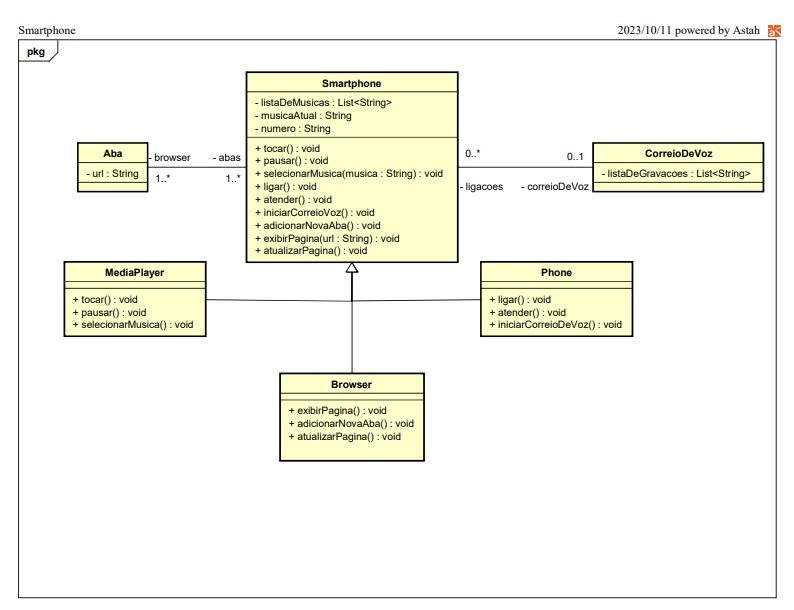

# Orientação a Objetos e UML: Diagramação de Classes do iPhone

# Descrição

Este é um modelo representativo do Smartphone herdando funcionalidades conforme o diagrama de classes abaixo:



# Programa

```java
// Interface para funcionalidades de um reprodutor musical
interface ReprodutorMusical {
    void tocar();
    void pausar();
    void selecionarMusica(String musica);
}

// Interface para funcionalidades de um telefone com correio de voz
interface TelefoneComCorreioVoz {
    void ligar();
    void atender();
    void iniciarCorreioVoz();
}

// Interface para funcionalidades de um navegador de internet
interface NavegadorInternet {
    void adicionarNovaAba(Aba aba);
    void exibirPagina(String url);
    void atualizarPagina();
}

// Classe CorreioDeVoz
class CorreioDeVoz {
    private List<String> listaDeGravacoes;

    public CorreioDeVoz() {
        listaDeGravacoes = new ArrayList<>();
    }

    public void iniciarGravacao() {
        System.out.println("Iniciando gravação de mensagem de voz");
    }
}

// Classe Aba
class Aba {
    private String url;

    public Aba(String url) {
        this.url = url;
    }

    public String getUrl() {
        return url;
    }
}

// Classe Smartphone que implementa as interfaces
class Smartphone implements ReprodutorMusical, TelefoneComCorreioVoz, NavegadorInternet {
    private CorreioDeVoz correioDeVoz;

    public Smartphone() {
        correioDeVoz = new CorreioDeVoz();
    }

    @Override
    public void tocar() {
        System.out.println("Tocando música");
    }

    @Override
    public void pausar() {
        System.out.println("Pausando música");
    }

    @Override
    public void selecionarMusica(String musica) {
        System.out.println("Selecionando música: " + musica);
    }

    @Override
    public void ligar() {
        System.out.println("Realizando chamada");
    }

    @Override
    public void atender() {
        System.out.println("Atendendo chamada");
    }

    @Override
    public void iniciarCorreioVoz() {
        correioDeVoz.iniciarGravacao();
    }

    @Override
    public void adicionarNovaAba(Aba aba) {
        System.out.println("Nova aba adicionada com URL: " + aba.getUrl());
    }

    @Override
    public void exibirPagina(String url) {
        System.out.println("Exibindo página: " + url);
    }

    @Override
    public void atualizarPagina() {
        System.out.println("Atualizando página");
    }
}

// Classe principal com o método main
public class Main {
    public static void main(String[] args) {
        Smartphone smartphone = new Smartphone();

        smartphone.tocar();
        smartphone.pausar();
        smartphone.selecionarMusica("Música 1");

        smartphone.ligar();
        smartphone.atender();
        smartphone.iniciarCorreioVoz();

        Aba aba1 = new Aba("www.example.com");
        smartphone.adicionarNovaAba(aba1);
        smartphone.exibirPagina(aba1.getUrl());
        smartphone.atualizarPagina();
    }
}

```